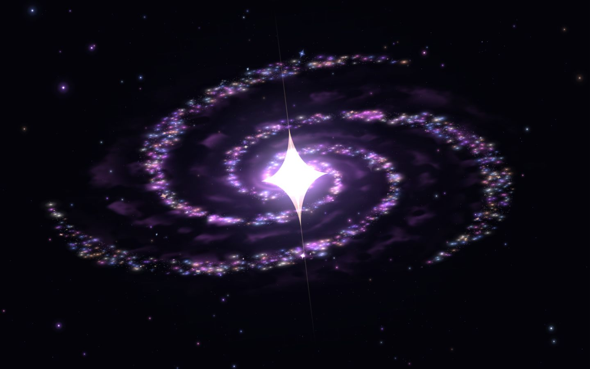
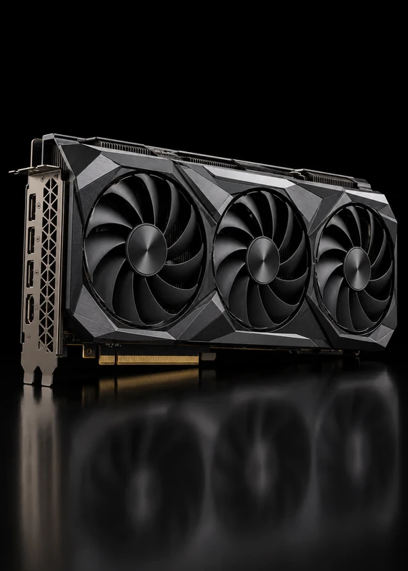
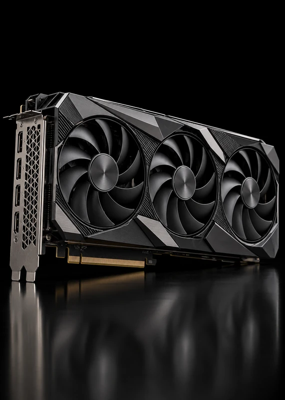
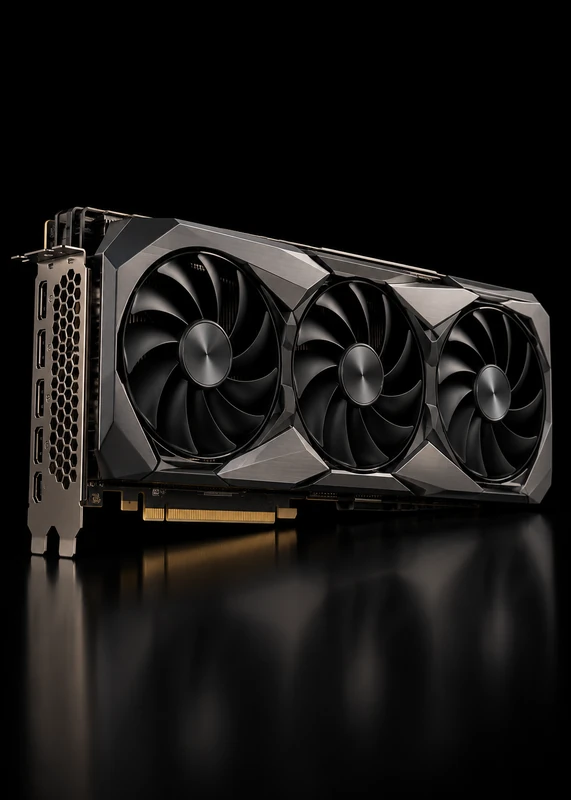

<h1 align="center">Cardable</h1>

A quiet little obsession. An offline GPU-card collection that's yours.

<strong>v1.2.2 · Windows x64 · Free · Offline play</strong>

<a href="https://resetrevxz.github.io/cardable/">Visit the website</a> · <a href="https://github.com/resetrevxz/cardable/releases/download/v1.2.2/Cardable-Setup-1.2.2.exe"><strong>Download Windows installer</strong></a> · <a href="https://github.com/resetrevxz/cardable/releases">All downloads</a>

## Your next collection

Cardable turns GPU hardware into collectible cards. Charge a pack, tear its seal and uncover a card with its own finish, rarity and history. The Windows app includes the game and Electron runtime, so players can install and play without developer tools.

- Physical-feeling pack openings and rarity-specific cinematics.
- Permanent cosmetic variants, sculpted frames and metallic card materials.
- Standard, Rare, brand, Classic, Royal, Titan and three-offer Picker packs.
- Shelf/Grid collection browsing, card details, achievements, Inspect and the expanded Director workspace.
- Four graphics tiers, independent FPS caps and quiet background behavior.

<table><tr><td align="center"> Radeon RX 7900 XTX</td><td align="center"> GeForce RTX 4090</td><td align="center"> GeForce RTX 3090</td></tr></table>

GPU artwork from the collection. These are artwork previews, not gameplay screenshots.

## Install on Windows

1. Download [Cardable-Setup-1.2.2.exe](https://github.com/resetrevxz/cardable/releases/latest/download/Cardable-Setup-1.2.2.exe).
2. Run setup. It installs for your Windows user and adds desktop/Start Menu shortcuts.
3. Open Cardable and start collecting. No Node.js, npm, terminal, account or Discord setup is required.

This community release is **unsigned**. Windows may show an unknown publisher or SmartScreen warning. Verify that the file came from this repository before continuing; don't disable your security software. SHA256SUMS.txt is included in each release.

Prefer a folder download? Get [Cardable-1.2.2-Windows-x64.zip](https://github.com/resetrevxz/cardable/releases/latest/download/Cardable-1.2.2-Windows-x64.zip), extract **the entire folder**, then run **Cardable.exe**. Its DLLs, `resources/`, `locales/` and other Electron files must stay together. Folder builds use manual downloads for updates.

The complete source is available with **Code → Download ZIP** or a Git clone. Source play opens `index.html` directly; it is a separate option from the ready-to-play Windows folder download. See [PLAY](PLAY.md) for backups, importing browser saves and recovery.

## How it plays

1. Packs refill over time, up to four stored packs.
2. Hold the opening key for three seconds, then cut or tear the wrapper.
3. Reveal the card and choose Keep or Delete after its presentation is ready.
4. Browse your collection, inspect its details and collectible finishes.

| Control | Action |
|---|---|
| Space / configured opening key | Hold to charge; a fresh Space press also Keeps a ready revealed card |
| Pointer or touch | Cut, select, tilt and interact; visible touch alternatives are provided |
| Enter | Contextual tear/advance/confirm where the opening shows the action |
| Ctrl/Cmd+K | Desktop command palette and bundled Help |
| F1 | Current shortcuts overlay |

## Settings worth knowing

**Medium** balances materials and motion. **Low** keeps a lighter presentation, and **Very Low** uses static effects and calm scenes. **High** gives the focused card and cinematics their full detail. FPS, hidden-tab sleep and visible-unfocused behavior stay independent from quality.

Reduced motion follows your system by default. Strobing defaults to **Safe**; **Full** has an explicit confirmation. Mono mode is available. A graphics preset does not authorize new flashes or guarantee a frame rate on every device.

## Saves and updates

Progress stays on your computer. Use **Settings → Data → Export save** for a JSON backup. To move from browser to desktop, export in the browser, import in the app and confirm the preview. **Studio photos are separate**: download them from the Album before a move or upgrade.

Installed builds check for newer published releases when online, download in the background and install after a successful save when you quit normally. The game itself works offline. Keep the same Windows user and installation location. Saves and photo storage are configured to survive ordinary upgrades and uninstall.

Public numbering started at **v1.0.0**; the current release is **v1.2.2 — One Cardable**. Earlier 4.x installations need the new installer once; the updater won't automatically downgrade. The game/save identity is preserved. See [PLAY](PLAY.md).

## Help and feedback

For slow rendering, choose Low/Very Low and a lower FPS cap. For a blank screen or startup issue, use bundled desktop Help and the existing Safe Mode/recovery options. For missing progress, check the original Windows user/shortcut and backups before resetting anything. Sound is currently unavailable.

[Report a bug](https://github.com/resetrevxz/cardable/issues/new/choose) with your app version, graphics preset, steps and the relevant pack/card. Attach diagnostics only after reviewing them for personal information. Use [content feedback](https://github.com/resetrevxz/cardable/issues/new/choose) for odds/catalog questions.

[Roadmap and acceptance](docs/ROADMAP.md) · [Known issues](docs/BUGS.md) · [Player guide](PLAY.md) · [Credits and licenses](NOTICE.md)

## Development

Use the complete repository, `npm ci`, then `npm run dev`. Build a local desktop handoff with `npm run deliver:desktop`. Build the website with `npm run site:build`. Follow [AGENTS](AGENTS.md), [Designs](Designs.MD), [BUILDING](docs/BUILDING.md) and [RELEASING](docs/RELEASING.md); the current restricted verification policy applies.

GitHub Desktop can open this repository and push ordinary commits. Each completed update gets a versioned GitHub Release with the installer, full folder ZIP, updater pair and checksums through the documented release workflow.

---

Cardable is an independent fan project. Hardware names, logos and photographs belong to their respective owners. No hardware vendor sponsors or endorses this project. Public source availability does not grant a license to third-party artwork. See [NOTICE](NOTICE.md).
